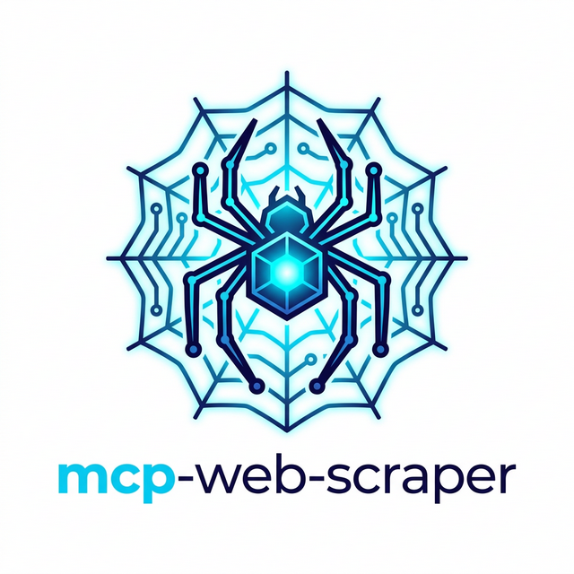

#  mcp-web-scraper

[](https://pypi.org/project/mcp-web-scraper/)
[](https://pypi.org/project/mcp-web-scraper/)
[](https://opensource.org/licenses/MIT)

Playwright tabanlı, Javascript render eden sayfaları otonom şekilde tarayan (scrape) ve bunu **Model Context Protocol (MCP)** standartlarıyla AI Asistanlarına sunan gelişmiş bir web scraper sunucusudur. 

## 🌟 Özellikler
- **`scrape_page`**: Herhangi bir URL'den metin içeriklerini, başlığı ve sayfaya dair metadataları okuyun.
- **`scrape_queue`**: Birden fazla URL'yi arka plan kuyruğuna (job queue) ekleyerek otonom olarak asenkron tarayın.
- **`watch_page`**: Belirli bir URL'in kaynak içeriği değiştiğinde canlı bildirimler (polling/events) alın.
- **`take_screenshot`**: Hedef web sayfasının tam ekran görüntüsünü yüksek boyutlu şifrelenmiş (Base64) biçimde yakalayın.
- **`fill_form`**: CSS Selector'ları kullanarak otomatik ve otonom şekilde web formları doldurun.
- **`extract_table`**: Hedefteki karmaşık HTML tablolarını kolayca yapılandırılmış JSON verilerine (Array) ayrıştırın.
- **`get_links`**: Sayfa üzerindeki tüm bağlantıları (links) tek tuşla etiketleyip çekin.

## 🚀 Anti-Bot (İnsan Taklidi / Stealth)
Eskimiş dış kütüphanelere bağlı kalmaksızın, kendi içinde barındırdığı **manuel stealth** protokolleri sayesinde:
- Cloudflare vb. `webdriver` algılayıcılarını tamamen maskeler.
- Yapay fare hareketleri ile gerçek insan taklidi yapar.
- İzole context, özel `user-agent` ve dil (`tr-TR`) ayarları üzerinden işlem sağlar.

## 🛠️ Kurulum

En kolay kurulum yolu, doğrudan PyPI üzerinden resmi paketi indirmektir. Sisteminizde **Python 3.10+** yüklü olmalıdır.

```bash
# 1. MCP sunucusunu (ve bağımlılıklarını) global olarak indirin
pip install mcp-web-scraper

# 2. Playwright otomasyonu için gereken Chromium tarayıcısını indirin
playwright install chromium
```

## 🎮 Kullanım (AI Asistanlarına Ekleme)

Bu server, standart bir `stdio` altyapısı kullanarak JSON-RPC 2.0 mimarisini destekler. AI istemcileriniz için (örn: Claude Desktop, Cursor, Antigravity) konfigürasyon dosyasına (`claude_desktop_config.json` veya IDE `mcp_config.json`) kullanım yönteminize göre aşağıdaki bloklardan birini eklemeniz yeterlidir:

**1. PyPI Üzerinden Pip Install Sonrası:**
```json
{
  "mcpServers": {
    "mcp-web-scraper": {
      "command": "mcp-web-scraper"
    }
  }
}
```

**2. UVX ile (Sıfır Kurulum, Anında Çalıştırma):**
```json
{
  "mcpServers": {
    "mcp-web-scraper": {
      "command": "uvx",
      "args": ["mcp-web-scraper"]
    }
  }
}
```

**3. GitHub Kaynak Kodundan Çalıştırma:**
```json
{
  "mcpServers": {
    "mcp-web-scraper": {
      "command": "python",
      "args": ["-m", "mcp_web_scraper"]
    }
  }
}
```

*Alternatif olarak, doğrudan Smithery komutları (`smithery.yaml`) aracılığıyla sisteminize anında entegre edebilirsiniz.*

### Deneme ve Geliştirme (Test)
Uçtan uca tüm bu MCP tool'larının gerçek dünyada nasıl çalıştığını (Wikipedia,E-ticaretarkadasim ve Example sayfalarında) test etmek için proje içindeki test betiğini kullanabilirsiniz:

```bash
# Tüm tool'ların çıktılarını terminale yansıtan test scripti
python test_real.py

# Unittest'leri test etmek isterseniz:
pytest tests/
```

## 👨‍💻 Geliştirici
- [Şeyhmus OK](https://github.com/iamseyhmus7)
